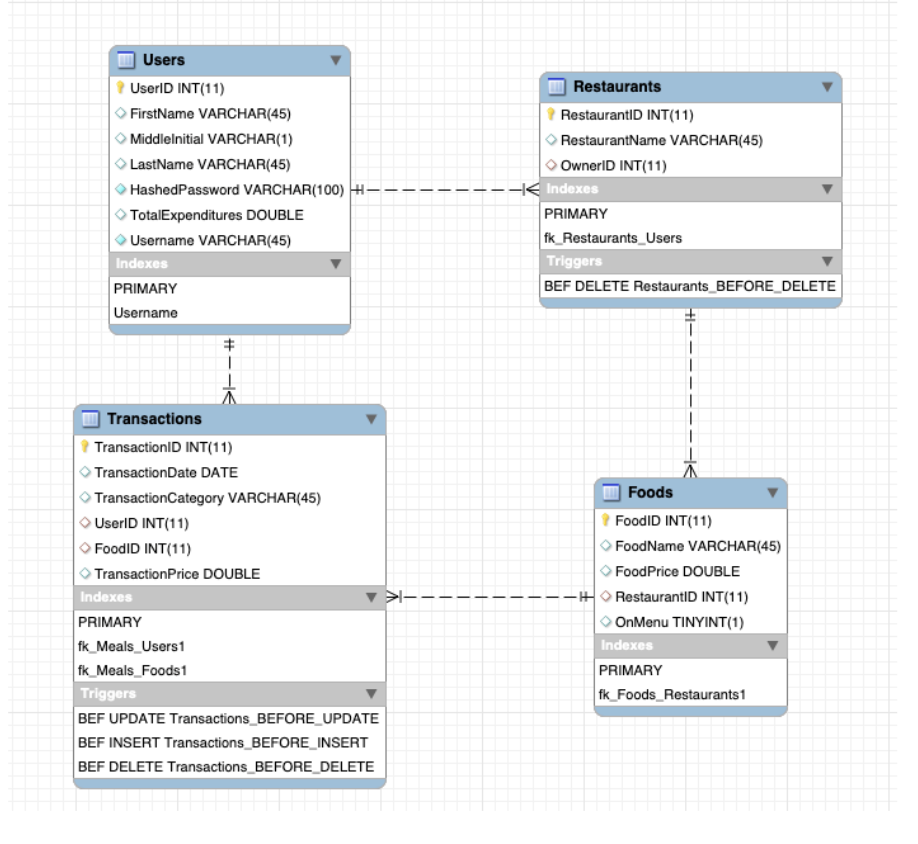
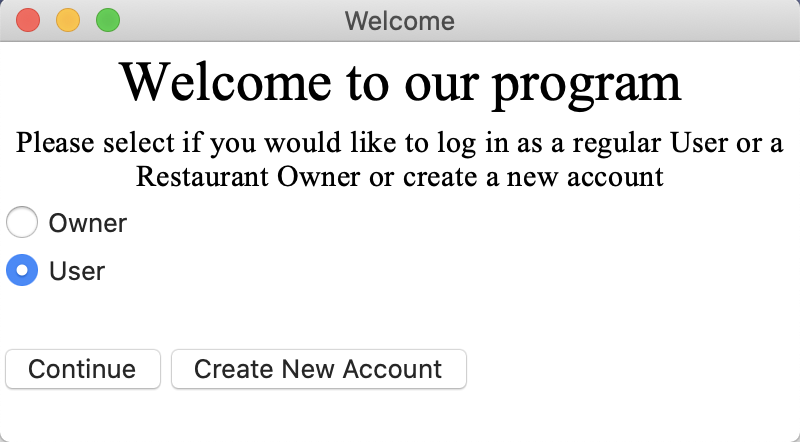
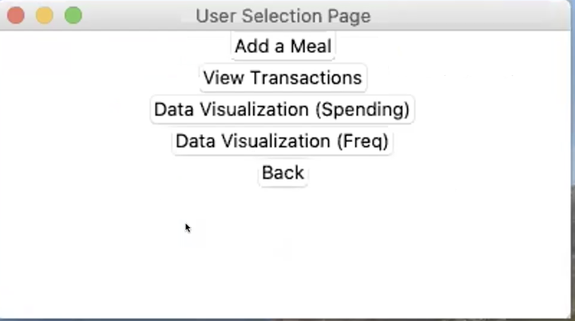
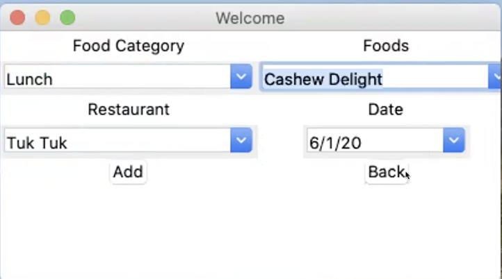
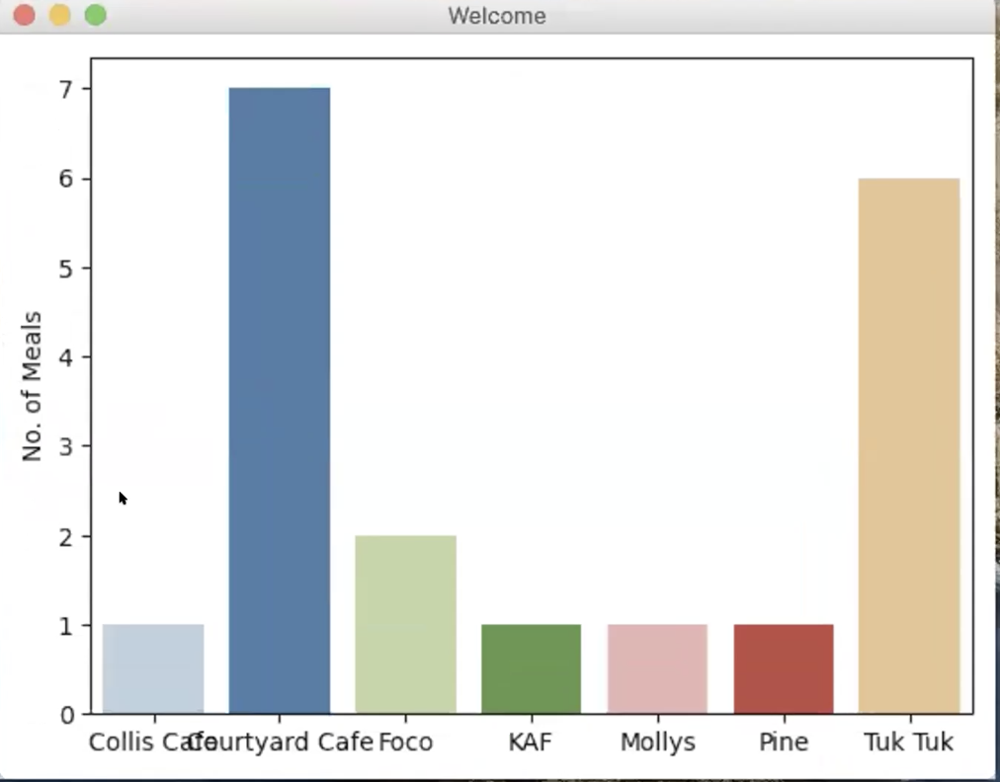

# Kitchen Nightmares
Kitchen Nightmares is an application that serves Dartmouth students, other Hanover residents’, Dartmouth Dining Services (DDS), and restaurant owners in Hanover by storing data about students and residents’ eating habits and summarizing and visualizing that data for users and DDS/restaurant owners. Hereafter we refer to all establishments where students or Hanover residents can purchase food as ‘restaurants.’ The application provides unique accounts for each user and lets users create, update, and view data about their food purchases they’ve made at restaurants in Hanover. The application provides all users visualizations of where they eat weighted by how often they eat at each restaurant or how much money they spend at each restaurant.

### Requirements
* TkInter
* Access to Data (unfortunately it is hosted on my school's private network)

### Implementation
Users can either log in as a regular user or a restaurant owner. Regular users will log each meal they eat, recording the foods they ate, which food category it belongs to, the restaurant, and the date of their meal. These foods are connected to restaurants/dining establishments both on and off campus. We assume that the users are paying with cash only, and thus transaction costs will be calculated with dollar amounts. Each restaurant may be associated with one user designated the restaurant owner for that restaurant. Restaurant owners are able to add foods to their restaurant’s menu, ‘delete’ foods (by taking them “off menu” without deleting them from the database), and change food items’ prices. Regular users are able to register a new account, however new restaurant owners are only added by the database administrator. 

Implementation is divided at a high level between the frontend, the GUI and data visualization, and the backend API and server. The frontend includes a python graphic user interface written with the TkInter python library and a custom visualization class that uses the matlibplot and seaborn python libraries. The backend is composed of a Node/Express RESTful API and server that connect to our own schema on a remote server.

### Code
The main challenge of this program is to maintain a relational database that can be altered with different CRUD operations. For example, a regular user is able add, update, delete, and read their food transactions. Similarly, restaurant owners are able to perform CRUD on food items on their menus. Here is the EERD we implemented:

The Users table will store all relevant information about the different Users. This is connected with the Restaurants table using a Many-to-One relationship, as each restaurant can only have one owner but one owner can own many restaurants. Restaurants are also connected to Food in a Many-To-One Relationship where each food only appears in one restaurant but each restaurant can have many foods. The Transactions Table serves as an intermediary table between the many-to-many relationship of users to food (as users can eat many different foods and a food can be eaten in many users) The transactions table has a TransactionID that serves as the primary key and marks down each transaction a user has. 

### Example
The user login page

The different options a user has

An example of adding a meal

An example Data Visualization
